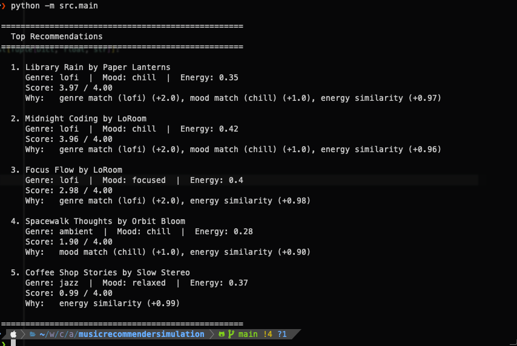
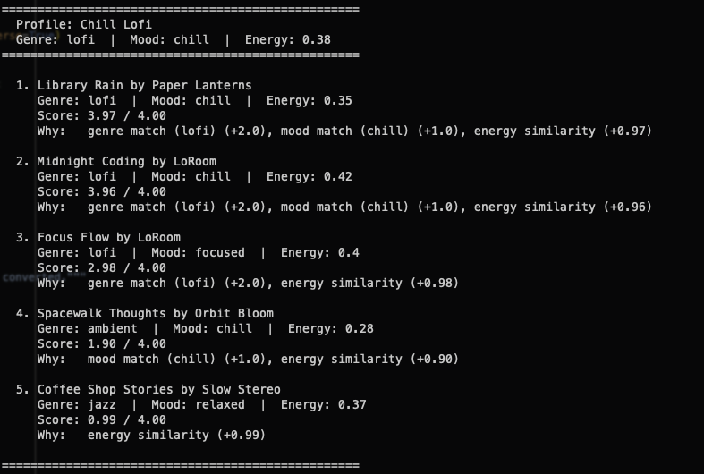
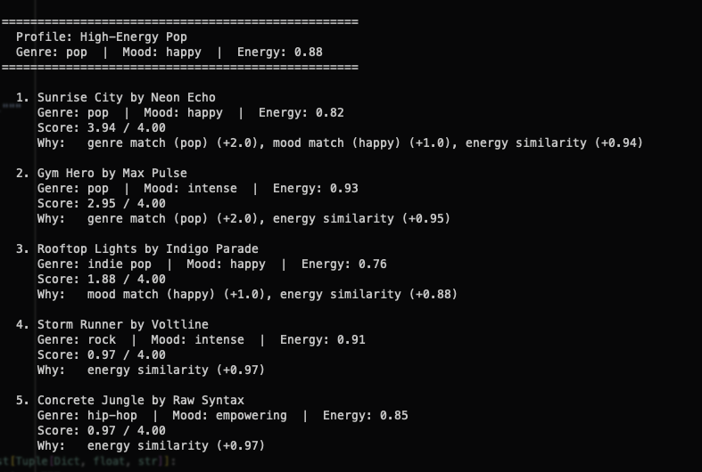
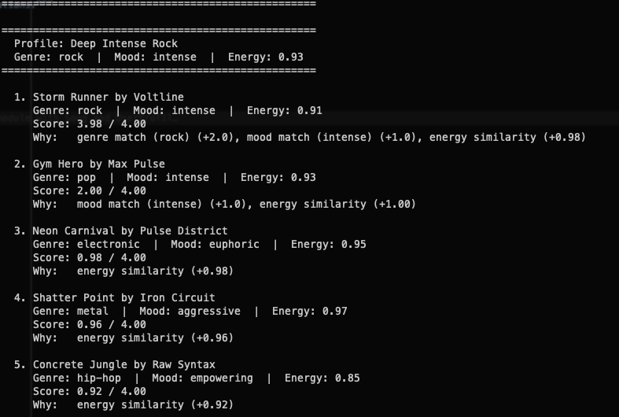
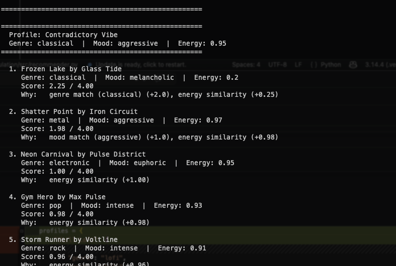
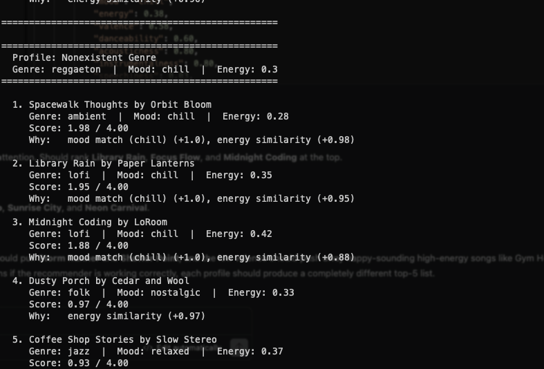
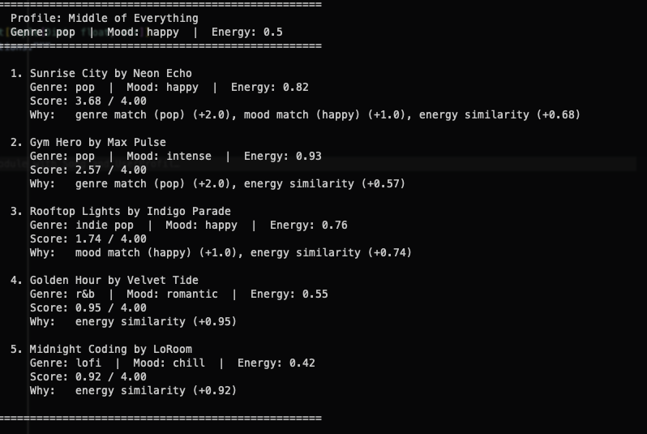
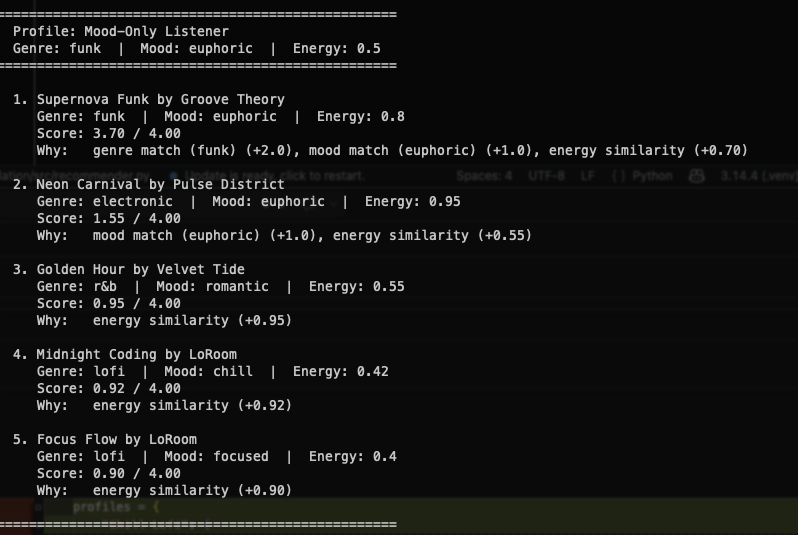
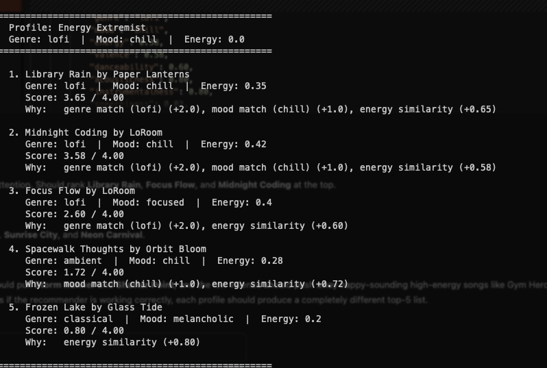

# 🎵 Music Recommender Simulation

## Project Summary

VibeFinder 1.0 is a CLI-first music recommender simulation. It loads an 18-song catalog from CSV, scores every song against a user taste profile using weighted genre, mood, and energy signals, and prints the top-k recommendations with plain-English explanations. The project explores how content-based filtering works, where simple scoring rules break down, and how weight choices create hidden biases — all through hands-on experiments with eight different user profiles ranging from "Chill Lofi" to deliberately adversarial edge cases like "Contradictory Vibe" and "Nonexistent Genre."

---

## How The System Works

Real-world platforms like Spotify and YouTube Music combine multiple strategies to predict what a listener will enjoy. Collaborative filtering finds users with similar listening histories and recommends what those neighbors liked. Content-based filtering analyzes the attributes of songs themselves — tempo, energy, mood — and matches them to a user's established taste profile. Production systems blend both approaches with deep learning on raw audio and natural language processing on reviews and social media. Our simulation focuses on **content-based filtering**: we define a musical "vibe" through numeric features that capture how a song feels emotionally, physically, and texturally, then score each song against a user profile using weighted distance. The closer a song's vibe is to the user's preferences, the higher it ranks.

### Song Features

Each `Song` object carries the following attributes from `data/songs.csv`:

- **`energy`** (0–1) — intensity level, from calm ambient to high-powered workout tracks
- **`valence`** (0–1) — emotional positivity, from dark and moody to bright and uplifting
- **`acousticness`** (0–1) — sonic texture, from synthetic/electronic to warm/organic
- **`danceability`** (0–1) — how much the song makes you move
- **`instrumentalness`** (0–1) — whether the track is mostly instrumental or vocal-driven (high for study music, low for sing-alongs)
- **`speechiness`** (0–1) — presence of spoken or rapped words vs. purely melodic content (high for hip-hop, low for ambient)
- **`tempo_bpm`** (56–168) — beats per minute, normalized during scoring
- **`mood`** — categorical label (happy, chill, intense, relaxed, moody, focused, romantic, empowering, melancholic, euphoric, nostalgic, aggressive)
- **`genre`** — categorical label (pop, lofi, rock, ambient, jazz, synthwave, indie pop, r&b, hip-hop, classical, electronic, folk, latin, metal, funk)

### UserProfile Preferences

Each `UserProfile` stores the listener's taste as target values to match against:

- **`favorite_genre`** — preferred genre (genre bonus)
- **`favorite_mood`** — preferred mood (mood bonus)
- **`target_energy`** — desired energy level (scored by similarity)
- **`target_valence`** — desired emotional positivity
- **`target_danceability`** — desired physical feel
- **`target_acousticness`** — preference for acoustic vs. electronic texture
- **`target_instrumentalness`** — preference for instrumental vs. vocal tracks
- **`target_speechiness`** — preference for spoken/rapped content

The functional API (`score_song`) also accepts `popularity`, `release_decade`, `lyrical_depth`, `emotional_intensity`, and `mood_tags` (list of strings) in the user preferences dictionary.

### Algorithm Recipe

#### OOP API (Recommender class)

The `Recommender` class scores every song against the user profile by adding up points from three signals:

| Signal | Points | How it works |
|---|---|---|
| **Genre match** | +1.0 | If the song's genre equals the user's `favorite_genre`, add 1.0 points. Otherwise add 0. |
| **Mood match** | +0.5 | If the song's mood equals the user's `favorite_mood`, add 0.5 points. Otherwise add 0. |
| **Energy similarity** | +0.0 – 2.0 | `2.0 * (1.0 - abs(song.energy - user.target_energy))`. A perfect energy match gives 2.0; the worst possible mismatch gives 0.0. |

**Maximum possible score: 3.5** (genre + mood + perfect energy).

These weights are the result of three rounds of experimentation. The original weights (genre +2.0, mood +1.0, energy +1.0) let genre dominate to the point where a quiet piano piece outranked a high-energy metal track for a user who wanted aggressive, high-energy music. We halved genre and doubled energy so that how a song actually feels matters more than what category it belongs to. Mood was briefly removed entirely, which proved it was needed as a tiebreaker — without it, "chill" and "focused" songs were treated identically. The final balance (genre 29%, mood 14%, energy 57% of max score) lets energy drive the primary ranking, genre act as a meaningful bonus, and mood break ties between otherwise similar songs.

#### Functional API (score_song / recommend_songs)

The functional API extends scoring to **8 weighted signals**, with weights controlled by a **Strategy pattern** — one scoring algorithm, swappable weight configurations:

| Signal | Balanced | Genre-First | Vibe-Match | Discovery | How it works |
| --- | --- | --- | --- | --- | --- |
| **Genre match** | 1.0 | 3.0 | 0.25 | 0.0 | Binary: 0 or 1 × weight |
| **Mood match** | 0.5 | 2.0 | 0.5 | 0.5 | Binary: 0 or 1 × weight |
| **Energy similarity** | 2.0 | 1.0 | 2.0 | 1.5 | (1 − abs(song − user)) × weight |
| **Popularity proximity** | 0.5 | 0.25 | 0.25 | −0.5 | (1 − abs(diff)/100) × weight; negative in discovery mode |
| **Decade match** | 0.75 | 0.25 | 0.0 | 0.0 | Tiered: exact=1.0, ±10yr=0.5, ±20yr=0.2, else=0 |
| **Lyrical depth** | 0.5 | 0.25 | 0.5 | 0.75 | (1 − abs(song − user)) × weight |
| **Emotional intensity** | 0.75 | 0.25 | 1.5 | 1.0 | (1 − abs(song − user)) × weight |
| **Mood tags** | 1.0 | 0.5 | 2.0 | 1.5 | (overlap / total user tags) × weight |

**Balanced max score: 7.0.** Each strategy reshapes which signals dominate without changing the scoring math.

#### Diversity-Aware Selection

When `diverse=True`, `recommend_songs` uses greedy selection with diversity penalties so the top-k results don't stack the same artist or genre:

- **Artist penalty** — each repeat halves the effective score (×0.5 per repeat).
- **Genre penalty** — kicks in after 2 songs in the same genre (3rd: ×0.70, 4th+: ×0.40).

The displayed score is always the original, unpenalized score so the user sees the true match quality.

### Scoring and Ranking

The system works in two steps:

1. **Scoring** — Loop through every song in the catalog and compute its match score using the recipe above.
2. **Ranking** — Sort all scored songs from best to worst match, then return the top _k_ results along with a human-readable explanation of why each song was recommended.

#### Sample Output



### Known Biases

- **Mid-energy gravity.** Energy controls 57% of the max score, which means songs in the 0.35–0.55 energy range are "safe" picks that appear in many profiles' top 5 because they are never far from any target. Users at the extremes (very calm or very intense) are systematically underserved.
- **Uneven genre representation.** Lofi has 3 songs in the catalog; most genres have exactly 1. A lofi user gets three strong matches to differentiate between. A rock or metal user gets one match and then filler ranked by energy proximity alone.
- **Mood as a weak tiebreaker.** At +0.5 out of 3.5 (14%), mood rarely changes the ranking. Gym Hero (intense) ranks #2 for a "happy pop" user because the 0.5-point mood penalty is smaller than the energy proximity bonus. The system cannot tell that "happy" and "intense" describe fundamentally different listening experiences.
- **OOP class still uses only 3 signals.** The `Recommender` class scores on genre, mood, and energy only. The functional API (`score_song`) uses all 8 signals including popularity, decade, lyrical depth, emotional intensity, and mood tags — but valence, danceability, acousticness, instrumentalness, and speechiness remain unused in both APIs.

### Complexity

The scoring loop is **O(n)** — it touches every song exactly once. The sort that follows is **O(n log n)**, but with 18 songs that is negligible. The bottleneck in a real system with millions of songs would be this loop, which is why production systems use approximate nearest-neighbor indexes instead of brute force — but the underlying scoring logic is identical.

---

## Getting Started

### Setup

1. Create a virtual environment (optional but recommended):

   ```bash
   python -m venv .venv
   source .venv/bin/activate      # Mac or Linux
   .venv\Scripts\activate         # Windows

2. Install dependencies

```bash
pip install -r requirements.txt
```

3. Run the app:

```bash
python -m src.main
```

### Running Tests

Run the starter tests with:

```bash
pytest
```

You can add more tests in `tests/test_recommender.py`.

---

## Experiments You Tried

### Baseline Profiles

Three standard profiles (Chill Lofi, High-Energy Pop, Deep Intense Rock) all produced sensible top-5 results where genre, mood, and energy aligned as expected.

#### Chill Lofi



#### High-Energy Pop



#### Deep Intense Rock



### Edge-Case / Adversarial Profiles

We designed five profiles to stress-test the scoring logic (results shown under current weights: genre +1.0, mood +0.5, energy +0.0–2.0):

| Profile | Prefs | What it exposes |
|---|---|---|
| **Contradictory Vibe** | genre: classical, mood: aggressive, energy: 0.95 | Under old weights, genre pulled toward Frozen Lake (energy 0.20) despite the user wanting energy 0.95. Under current weights, Shatter Point (metal, aggressive, energy 0.97) correctly ranks #1 because energy dominance overrides the genre mismatch. |
| **Nonexistent Genre** | genre: reggaeton, mood: chill, energy: 0.30 | No song matches the genre, so the +1.0 bonus never fires. Scoring falls back to mood + energy only (max 2.5), showing how the system degrades when a user's taste falls outside the catalog. |
| **Middle of Everything** | genre: pop, mood: happy, energy: 0.50 | Energy 0.50 is equidistant from many songs, so energy similarity loses discriminating power. Songs with very different feels (Golden Hour, Midnight Coding) end up with near-identical scores. |
| **Mood-Only Listener** | genre: funk, mood: euphoric, energy: 0.50 | Only one funk song exists. After Supernova Funk at #1, the remaining top 5 are unrelated mid-energy songs (Golden Hour, Midnight Coding, Focus Flow) ranked by energy proximity alone — the system has nothing left to say. |
| **Energy Extremist** | genre: lofi, mood: chill, energy: 0.0 | Target energy 0.0 is below every song in the catalog. The system still correctly picks lofi/chill songs first, but scores are low (2.80/3.50 at best), honestly reflecting that nothing in the catalog matches. |

#### Contradictory Vibe



#### Nonexistent Genre



#### Middle of Everything



#### Mood-Only Listener



#### Energy Extremist



### Key Takeaway

After rebalancing (genre 1.0, mood 0.5, energy 2.0), the worst failures from the original weights are fixed — Contradictory Vibe no longer recommends a quiet piano piece for an aggressive high-energy user. The functional API now scores on 8 signals (including popularity, decade, lyrical depth, emotional intensity, and mood tags) and supports 4 swappable strategies plus diversity-aware selection, which significantly reduces filter-bubble effects. But the edge cases still expose a core limitation: with only 18 songs, users with niche genres or rare moods run out of meaningful matches quickly, and the system fills the rest with proximity filler.

---

## Limitations and Risks

- **Tiny catalog.** 18 songs is too small to represent real musical diversity. Most genres have a single song, so the system often runs out of meaningful matches after one or two recommendations and fills the rest with energy-proximity filler.
- **No understanding of lyrics, language, or culture.** The system scores on numeric features and string-matching labels. It cannot tell that a Spanish-language Latin track and an English pop track serve different cultural contexts, or that a song's lyrics might make it inappropriate for certain listeners.
- **Single fixed profile per user.** Real people listen differently depending on time of day, activity, and mood. VibeFinder assumes one static taste profile, which means it cannot recommend workout music in the morning and study music at night for the same person.
- **Filter bubble risk.** In standard mode the system always recommends the closest matches. The diversity mode and discovery strategy help, but a lofi listener will still mostly see low-energy songs. In a real product, this could narrow what artists get exposure and what listeners discover.
- **No feedback loop.** The system cannot learn from skips, replays, or thumbs-up/down. Its weights are fixed at development time, not adapted to individual user behavior.

See [model_card.md](model_card.md) for a deeper analysis.

---

## Reflection

[**Model Card**](model_card.md) | [**Profile-Pair Comparisons**](reflection.md)

Building this recommender taught me that turning data into predictions is mostly about choosing what to measure and how much each measurement matters. The scoring function is just addition and subtraction, but the weights you assign — how much genre counts versus energy versus mood — determine everything about what the system considers "good." A small change (halving genre from 2.0 to 1.0) completely rearranged the recommendations for edge-case users. The algorithm itself is simple; the hard part is deciding what "similar" means.

The most important lesson was about where bias hides. It does not show up as an obvious error — the system never crashes or returns garbage. Instead, it shows up as quiet exclusion: users whose preferred genre has only one song in the catalog get worse recommendations than users whose genre has three. Users at the extremes of the energy range are systematically underserved because most songs cluster in the middle. Expanding from 3 signals to 8 and adding diversity penalties helped, but some features (valence, danceability, acousticness, instrumentalness, speechiness) are still unused — meaning the system cannot fully distinguish a happy dance track from a dark slow ballad if they share genre and energy. In a real product, these gaps would shape what millions of people hear without anyone noticing, because the recommendations would still look plausible.

---

## Challenge Checklist

- [x] **Challenge 1: Add Advanced Song Features** — Added 5 new attributes to the dataset and scoring: `popularity` (proximity to target, 0–100 scale), `release_decade` (tiered matching: exact/±10yr/±20yr), `lyrical_depth` (distance similarity), `emotional_intensity` (distance similarity), and `mood_tags` (set-overlap ratio). Each has a math-based scoring rule in `score_song()`. The functional API now scores on 8 weighted signals instead of 3.

- [x] **Challenge 2: Create Multiple Scoring Modes** — Implemented a Strategy pattern via a `STRATEGIES` dictionary with 4 modes: **balanced** (all signals contribute proportionally), **genre_first** (categorical labels dominate), **vibe_match** (emotional intensity and mood tags drive rankings), and **discovery** (genre disabled, popularity inverted to surface underground tracks). The scoring math stays identical — only the weight multipliers change.

- [x] **Challenge 3: Diversity and Fairness Logic** — Added a diversity-aware greedy selection mode (`diverse=True` in `recommend_songs`). Artist penalty halves the effective score for each repeat appearance (×0.5^n). Genre penalty kicks in after 2 songs in the same genre (3rd: ×0.70, 4th+: ×0.40). Displayed scores remain unpenalized so users see true match quality; a "(diversity pick)" note is appended when the penalty changed the pick order.

- [x] **Challenge 4: Visual Summary Table** — Used the `tabulate` library to render formatted terminal output with columns for rank, song title/artist, genre/mood/decade/popularity metadata, an ASCII score bar (`[========----] 6.52/7.0`), and word-wrapped reason strings. Each profile prints both standard and diverse rankings side by side for comparison.
